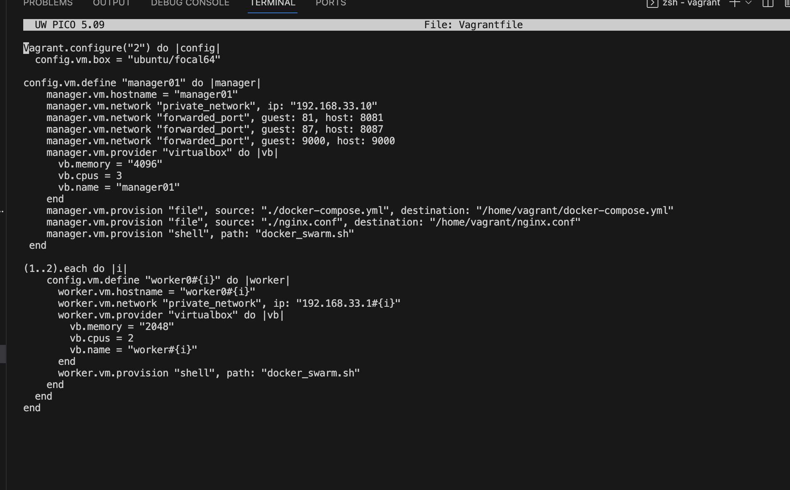
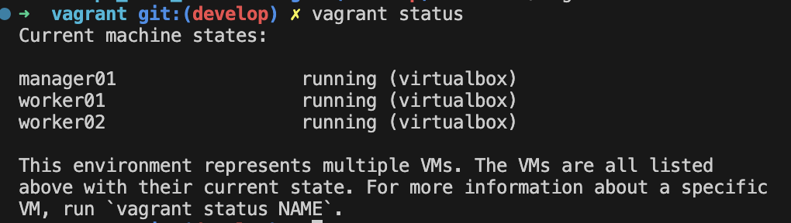

## Part 1. Запуск нескольких docker-контейнеров с использованием docker compose

1) Пишем `Dockerfile` для каждого отдельного сервиса

- `Database` \
Для базы данных пишем простой докерфайл на основе стабильной версии постгреса, который инициализирует при сборке заданные базы данных

- `Others services` \
Для session-service и всех последующих сервисов пишем подобный multi-stage докерфайл, который выполняет две задачи:
- На 1 этапе копирует файлы зависимости и выполняет установку этих зависимостей \
  На 2 этапе выполняет сборку проекта и его запуск 

Итоговые размеры образов, выведенные командой `docker images` получился небольшим благодаря multi-stage сборке

2) Далее пишем `docker-compose.yml` файл, для корректной сборки и взаимодействия всех образов

3) После сборки `docker-compose` убеждаемся, сервисы доступны 

- Далее собранные и запущенные образы, выведенные при помощи `docker ps`

4) Теперь нам нужно прогнать заготовленные тесты через `postman` и удостовериться, что все они проходят успешно 

## Part 2. Создание виртуальных машин

- Скачиваем, устанавливаем `vagrant`, затем инициализируем его в `src` при помощи `vagrant init`

- Пишем `Vagrantfile` для одной ВМ и прописываем перенос исходного кода веб-сервиса

- Поднимаем ВМ при помощи `vagrant up`

- Подключаемся к созданной машине при `vagrant ssh` и смотрим, что исходный код проекта встал, как надо

- Останавливаем и уничтожаем ВМ

## Part 3. Создание простейшего docker swarm

1) 
- Модифицируем Vagrantfile для создания трех машин

- Пишем скрипт для: \
  установки `docker` внутрь ВМ, \
  инициализации `swarm` для `manager01`, \
  подключения к `swarm` для `worker01/02`

2) 
- Грузим наши образы на докерхаб при помощи `docker push s21laneryel/<name-service>`
 

- Модифицируем `docker-compose.yml` для подгрузки образов с `docker hub`, для этого нам нужно:\
1.Поменять у всех сервисов строки `build` на `image` и указать имена, как в докерхабе\
2.Везде убрать строку `ports`, дабы сделать сервисы недоступными снаружи напрямую\
3.Добавить образ `nginx`, чтобы использовать его в качестве прокси-сервера для доступа к сервисам снаружи\

3) 
- Поднимаем ВМ при помощи `vagrant up` и смотрим статус машин

- Подключаемся к `manager01` при помощи `vagrant ssh manager01` и смотрим инициализировался ли `docker swarm` и перенесся ли `docker-compose.yml`

- Далее тут же в `manager01` запускаем стек сервисов при помощи `docker stack deploy` и смотрим сервисы

4) 
- Пишем кастомный `nginx.conf` для проксирования запросов черех `nginx`, при этом сами сервисы gateway service и session service недоступны напрямую. 

- Блок с образом `nginx` уже добавлен в модифицированный `docker-compose.yml`

5) 
- Прогоним тесты через `postman`

6) 
- Посмотрим распределение контейнеров по узлам

7) 
- Устанавливаем отдельным стеком `portainer` внутри кластера

- Собственно, `portainer`

